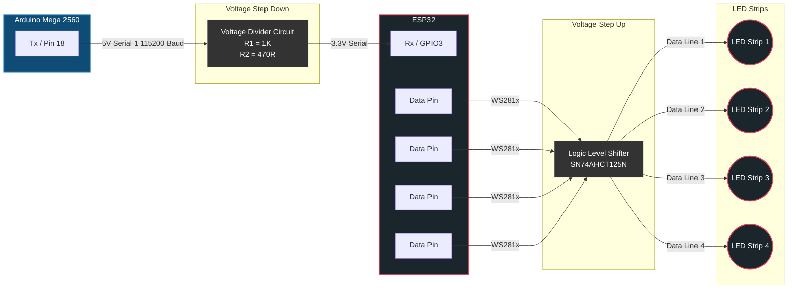

# LED Controller Project: Arduino Mega to ESP32

This repository contains the wiring and logic flow for a multi-strip LED controller setup utilizing an **Arduino Mega 2560** for high-level logic and an **ESP32** for WLED/FastLED driving.

---

## 🔌 Wiring Reference
The following diagram illustrates the standard multi-strip digital wiring for WLED-based systems.

---

## 📊 System Architecture & Data Flow
The ESP32 acts as the primary driver, receiving "Fire & Forget" JSON commands from the Arduino Mega via a voltage-divided serial link.
If using a voltage divider circuit, use lower value resistors to ensure the logic falls below 0.8V
I used 470R and 1K values for my R1 and R2 and that worked, while 1K and 2K did not.

