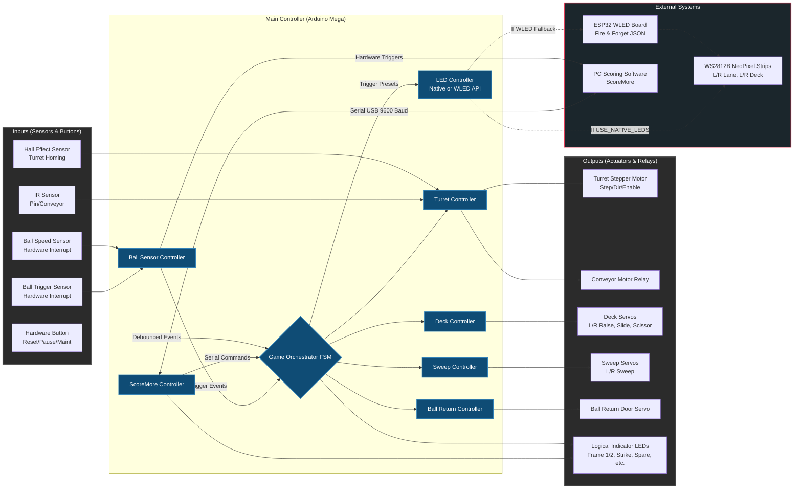
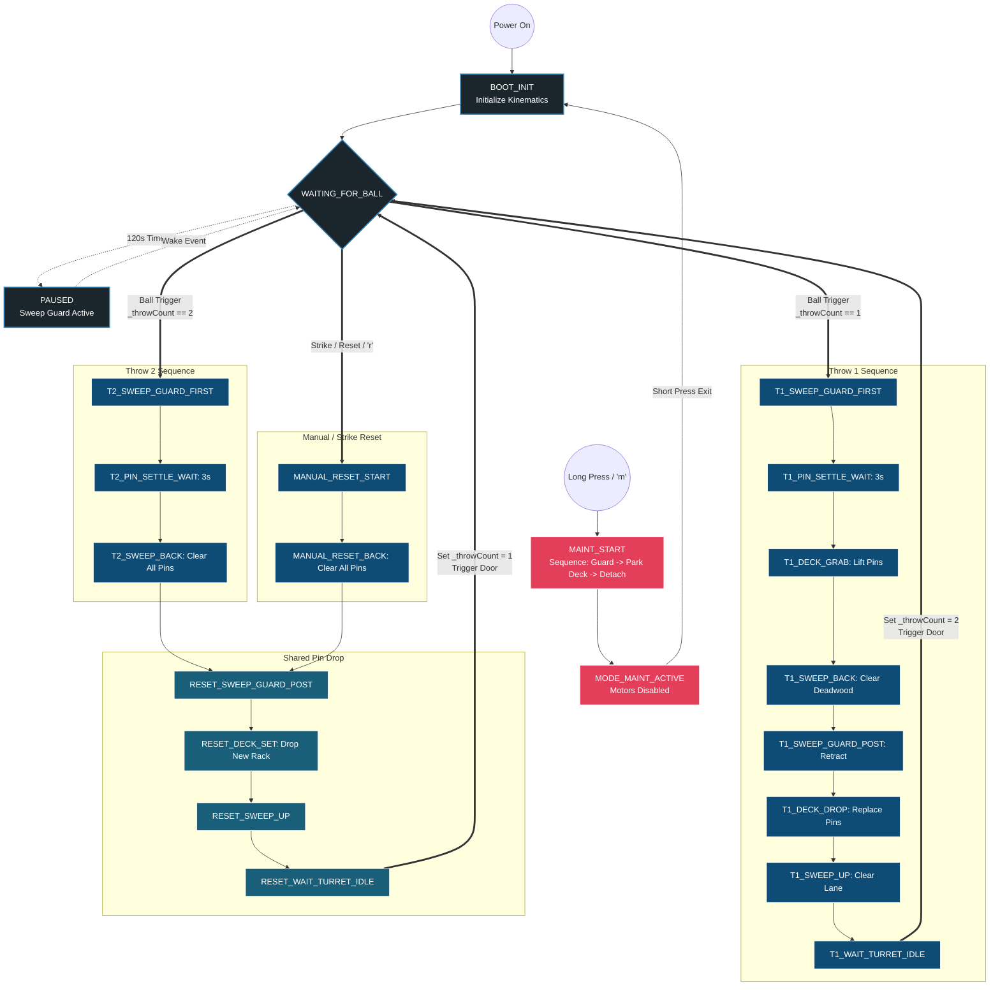

# 3D Printed Mini Bowling Alley: Pinsetter Controller

This repository contains the core logic for a state-driven, decoupled pinsetter architecture. The primary execution logic resides in the main `.ino` file, while hardware assignments and tuning variables are isolated in `pin_config.h` and `general_config.h`.   The the number of changes needed from the original script was minimized, however some pin out changes were required on the Arduino Mega board.  Please see the summary [here](./docs/pin_changes.md).

---

## 1. Event-Driven Architecture & Short Loop Time

The system relies on a non-blocking Finite State Machine (FSM) architecture. The main `loop()` contains zero `delay()` statements and executes rapidly by continuously polling the `.update()` methods of each subsystem controller.

This short loop time is a strict mechanical necessity for three reasons:
1. **Stepper Motor Pulses:** The `AccelStepper` library requires frequent, uninterrupted execution to generate the precise microsecond pulses needed for smooth turret rotation.
2. **Asynchronous Serial Parsing:** `ScoreMoreSerial.update()` must constantly read incoming bytes from the PC to prevent buffer overflow and ensure immediate hardware responses.
3. **Hardware Interrupts:** The dual ball sensors utilize hardware interrupts (ISRs). A fast main loop ensures `BallSensor.updateAndCheck()` processes these flags instantly, keeping the `GameOrchestrator` synchronized with the physical ball.

When a subsystem needs to wait (e.g., waiting for a servo tween or pin settling), it logs the current `millis()` timestamp, updates its state, and yields control back to the main loop until the target duration has elapsed.

---

## 2. Distributed Processing: Why WLED Integration?

LED animations are offloaded to an external ESP-WROOM32 board running WLED. The primary Arduino commands this board using a "fire-and-forget" JSON API over `Serial1`.

Driving WS2812B NeoPixel strips directly from the primary microcontroller requires disabling hardware interrupts while data is pushed down the strip. Given the length of the lane and deck strips, this process would block the CPU for several milliseconds, breaking the AccelStepper pulse timing (causing lost steps) and creating blind spots for the ball trigger ISRs. Offloading the LEDs allows for not only cool effects that can be customized from your smart phone but this also allows the Arduino Mega to focus entirely on real-time kinematics and game state FSM execution.  See [link](./docs/ESP32_wiring.md) for more wiring information.

> Since this requires more hardware, an alternative simple approach has now been implemented to natively use 'Adafruit_NeoPixel.h' for very simple lighting effects.
> Unfortunately, these lighting effects will always be simple because the led commands block interrupts which confolicts with the FSM logic on current hardware.
>
> Mixing Adafruit_NeoPixel and Servo on an AVR microcontroller creates a direct hardware conflict.
>
> The WS2812B data protocol lacks a clock line and relies on precise microsecond timing. To prevent data corruption, the Adafruit_NeoPixel library calls cli() to disable all global interrupts when pushing data to the strip.
> Updating 104 LEDs requires roughly 30 microseconds per LED. Every time .showAll() executes, interrupts are blocked for approximately 3.12 milliseconds.
> 
> The standard Servo library relies on a hardware timer interrupt firing every 20 milliseconds to generate 1ms to 2ms pulses for the 7 active servos. When .showAll() executes rapidly during the COMET or STRIKE animations, it repeatedly blinds the CPU to these timer interrupts. The servos will receive truncated or stretched PWM pulses, resulting in jitter or uncommanded movement.  
> If this is a problem, please report the issue and more basic sequence will be implemented.

---

## 3. Subsystem Breakdown

The codebase is modularized into distinct C++ classes, each managing a specific hardware zone.

| Controller | Function | Core Hardware (`pin_config.h`) |
| :--- | :--- | :--- |
| **TurretController** | Manages the stepper motor that loads pins into the deck. Tracks homing, pin detection lockouts, and empty-turret purges. | `STEP_PIN`, `DIR_PIN`, `STEPPER_ENABLE_PIN`, `IR_SENSOR_PIN`, `HALL_EFFECT_PIN`, `MOTOR_RELAY_PIN` |
| **DeckController** | Controls the sliding, raising, dropping, and scissor mechanisms that set and pick up the pins on the pindeck. | `SCISSOR_PIN`, `SLIDE_PIN`, `RAISE_LEFT_PIN`, `RAISE_RIGHT_PIN` |
| **SweepController** | Drives the left and right sweep arms to clear deadwood using non-blocking tweening for smooth movement. | `LEFT_SWEEP_PIN`, `RIGHT_SWEEP_PIN` |
| **BallReturnController** | Operates the safety door for the ball return, holding it open on a timer after a frame clears. | `BALL_RETURN_PIN` |
| **BallSensorController** | Monitors the physical ball speed and trigger sensors using hardware interrupts to guarantee detection. | `BALL_SENSOR_PIN`, `BALL_SPEED_PIN` |
| **NativeLedController** / **WledController** | Manages LED animations and states. Conditionally compiled to either drive WS2812B strips natively or translate game events into JSON preset triggers for an external ESP32. | `DECK_PIN_L`, `DECK_PIN_R`, `LANE_PIN_L`, `LANE_PIN_R` (Native) OR `Serial1` (WLED Fallback) |
| **ScoreMoreController** | Parses incoming serial data from the scoring software to drive lane states, strike animations, and physical hardware indicators. | `Serial` (Main USB), `SM_STRIKE_LIGHT`, `SM_SPARE_LIGHT`, `SM_PIN_1` |

---

## 4. The Game Orchestrator

The `GameOrchestrator` acts as the master FSM. Rather than directly controlling hardware pins, it commands poses and sequence triggers to the subsystem controllers. 

Key responsibilities include:
* **Boot Sequence:** Safely homing the turret, clearing the deck, and priming the initial 10 pins.
* **Throw Cycle:** Determining if a Throw 1 (grab and sweep) or Throw 2 (deck clear) is required based on the ball trigger and `_throwCount`.
* **Background Fetching:** Instructing the turret to refill in the background while waiting for the bowler.
* **State Management:** Handling power states, timeouts, and emergency overrides.

---

## 5. Hardware Interface & Operation

The physical interface relies on a single hardware button connected to `PINSETTER_RESET_PIN`. A non-blocking debounce algorithm distinguishes between tap and hold durations to control three distinct system states.

### Standard Operation (Short Press < 1000ms)
During normal operation, a short press acts as a manual frame reset. It aborts the current sequence, drops the sweep to clear deadwood, resets `_throwCount` to 1, and sends a hardware reset pulse back to the ScoreMore PC software.

### Pause Mode (Idle Timeout)
To protect servos and reduce power consumption, the orchestrator implements an automatic pause state. 
* **Trigger:** The system idles in `WAITING_FOR_BALL` for 2 minutes (120,000 ms) without detecting a ball or receiving a serial command.
* **Execution:** The sweep arms drop to `GUARD` to physically block the pit. The ESP32 is commanded to `WLED_PRESET_PAUSE`. Background pin drops are suspended.
* **Wake:** Throwing a ball (breaking the IR beam), a short button press, or a serial `'t'` command immediately wakes the system, raising the sweep arms and resuming normal gameplay.

### Maintenance Mode (Long Press ≥ 1000ms)
Maintenance Mode is a safe state designed for clearing jams or making physical adjustments without fighting motor torque.

* **Entering (Long Press or `'m'` serial command):**
  1. **Emergency Halt:** Turret stops instantly; ball return door snaps closed.
  2. **Clearance:** Deck forces scissors open to drop held pins; sweep moves to `GUARD`.
  3. **Decoupling:** Deck lowers to maintenance height. The `SlideServo` is explicitly detached, and the turret `STEPPER_ENABLE_PIN` is pulled HIGH to cut stepper coil power. The WLED strip updates to the maintenance preset.
* **Exiting (Short Press):**
  A short press exits Maintenance Mode. Servos re-attach and stepper torque is restored. The system transitions directly to the `BOOT_INIT` state. The ensuing booting routine automatically handles the LED preset transitions and executes a complete re-homing sequence for the turret, deck, and sweep before resuming gameplay.
